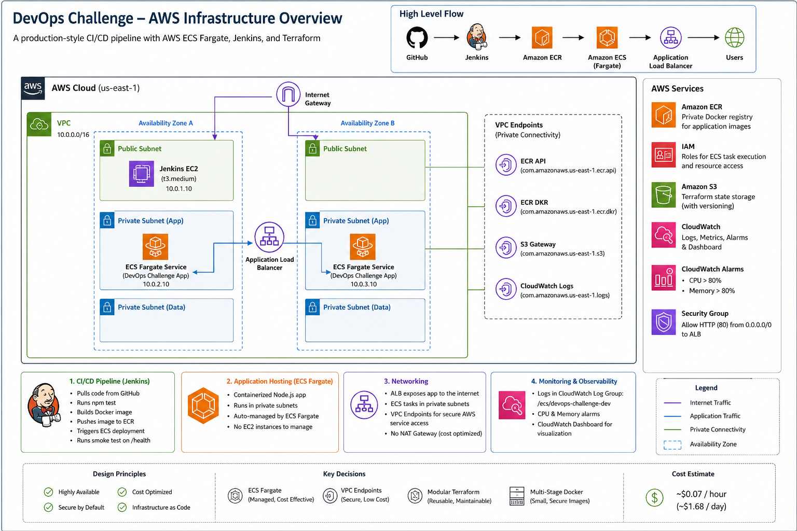

| Stage | Description |
|---|---|
| Checkout | Pulls latest code from GitHub |
| Test | Runs `npm test` — unit tests must pass before build |
| Build Docker Image | Multi-stage Docker build tagged with build number |
| Push to ECR | Authenticates and pushes image to Amazon ECR |
| Deploy to ECS | Forces new ECS deployment and waits for stability |
| Smoke Test | Hits `/health` endpoint to confirm deployment succeeded |

---
## Architecture Overview

The following diagram shows the production-ready AWS infrastructure, CI/CD pipeline, networking, ECS Fargate deployment model, VPC endpoints, and monitoring setup used in this assessment.

---
## Design Decisions

### Why ECS Fargate over EC2 or EKS?
Fargate removes the need to manage underlying servers — no patching, no capacity planning. It's more cost-effective than EKS (which has a $0.10/hr control plane cost) for a single service deployment, and simpler than managing EC2 Auto Scaling groups directly.

### Why VPC Endpoints instead of NAT Gateway?
NAT Gateway costs ~$0.045/hr plus data transfer charges (~$33/month minimum). VPC Endpoints for ECR, S3, and CloudWatch Logs cost ~$0.01/hr each and provide a more secure, private path for AWS service communication. This is a production best practice for cost and security.

### Why Modular Terraform?
Each module (networking, ECR, IAM, ALB, ECS, monitoring) has a single responsibility. This mirrors real-world team structures where networking, security, and application infrastructure are managed separately. Modules are reusable across environments.

### Why Multi-Stage Docker Build?
The builder stage installs all dependencies. The production stage copies only runtime artifacts — no build tools, no dev dependencies. This reduces image size and attack surface. The app runs as a non-root user (`nodeuser`) for additional security.

### Why Jenkins over GitHub Actions?
Jenkins was chosen as the preferred option per the challenge requirements. Jenkins provides more flexibility for complex pipelines, supports a wider range of plugins, and is self-hosted giving full control over the build environment. The Jenkinsfile is stored in the repository as code, ensuring pipeline changes go through the same review process as application changes.

---

## Monitoring

- **CloudWatch Log Group:** `/ecs/devops-challenge-dev` — all container logs
- **CPU Alarm:** triggers when ECS CPU utilization exceeds 80%
- **Memory Alarm:** triggers when ECS memory utilization exceeds 80%
- **CloudWatch Dashboard:** visualizes CPU, memory, and application logs

---

## Assumptions

- Single environment (dev) is sufficient for this assessment
- A single ECS task (desired count: 1) is appropriate for demo purposes
- HTTP only (no HTTPS/TLS) is acceptable for this assessment
- Jenkins server is manually bootstrapped once via user data script

---

## Limitations and Improvements

| Limitation | Improvement |
|---|---|
| HTTP only | Add ACM certificate and HTTPS listener on ALB |
| Single availability zone for Jenkins | Run Jenkins in Auto Scaling Group for HA |
| No rollback mechanism | Implement automatic rollback on failed deployment |
| Manual Jenkins setup | Add Jenkins EC2 to Terraform as a module |
| Single environment | Add staging environment with approval gate before production |
| No image vulnerability scanning | Add Trivy or ECR scan results check in pipeline |
| Jenkins credentials as secret text | Use IAM instance role on Jenkins EC2 to eliminate long-lived credentials |

---

## Cost Estimate (Personal AWS Account)

| Resource | Estimated Cost |
|---|---|
| ECS Fargate (0.25 vCPU, 0.5GB) | ~$0.01/hr |
| Application Load Balancer | ~$0.02/hr |
| VPC Endpoints (x4) | ~$0.04/hr |
| ECR Storage | ~$0.10/GB/month |
| CloudWatch (within free tier) | ~$0 |
| **Total** | **~$0.07/hr (~$1.68/day)** |

> Run `terraform destroy` after assessment to stop all charges.

---

## Live Application

- **Health Check:** `http://devops-challenge-dev-alb-355201639.us-east-1.elb.amazonaws.com/health`
- **API Root:** `http://devops-challenge-dev-alb-355201639.us-east-1.elb.amazonaws.com`
- **Jenkins:** `http://3.236.159.19:8080`

---

## Author

Light Osita-Amaechi
DevOps Engineer